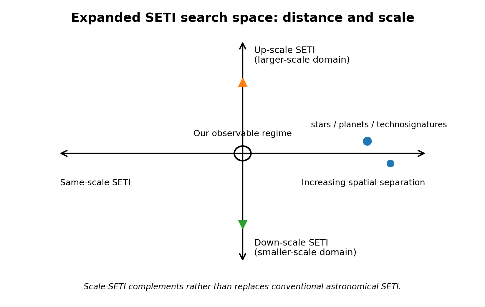
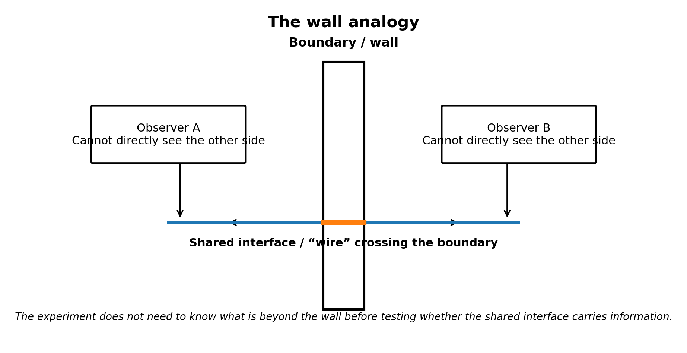
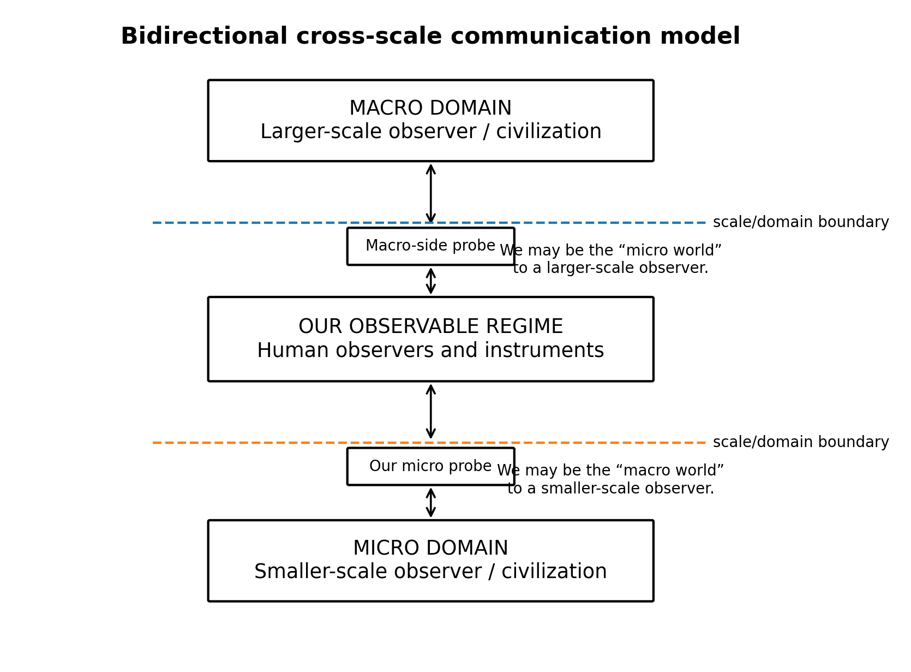
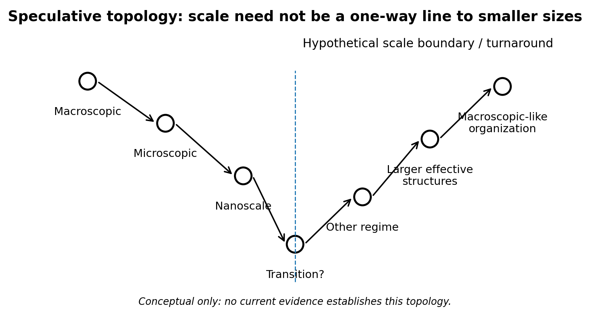
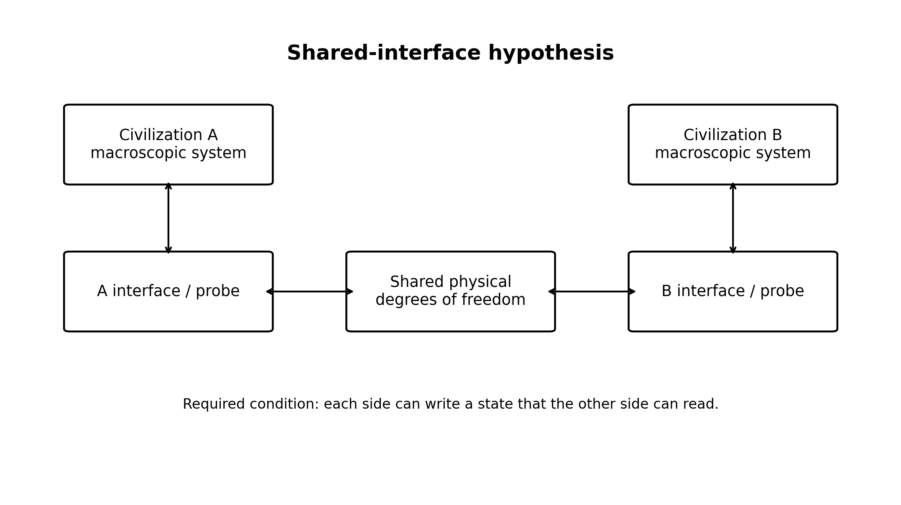
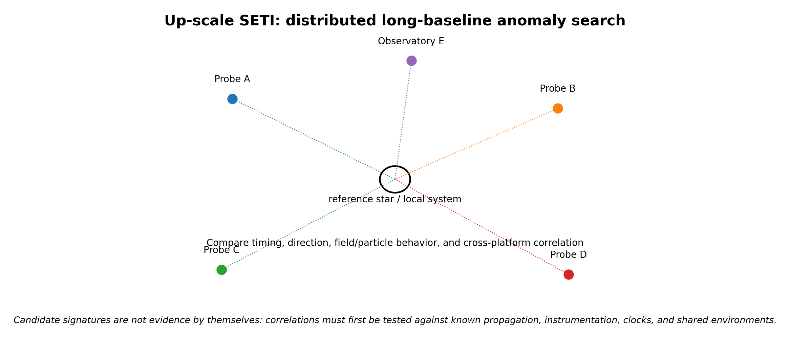
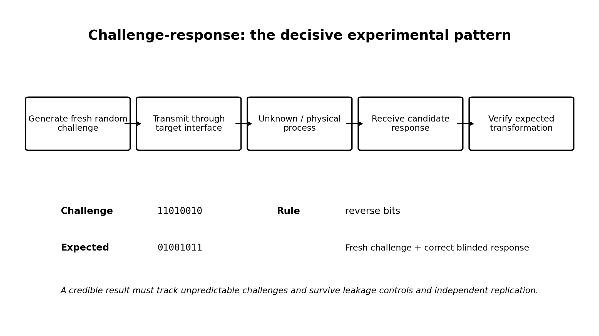
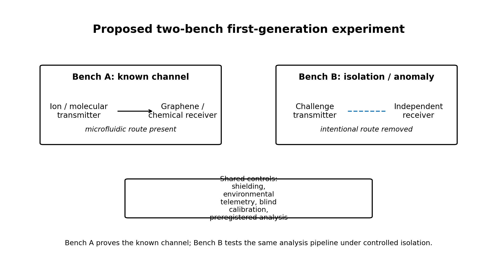

# Scale-SETI
## A Search for Technological Intelligence Across Physical Scale

**Concept Paper Candidate 1.0**  
**Tim Boccaleri**  
**September 2026**

> Speculative research concept. Candidate 1.0 separates established science from hypotheses and defines testable search methodologies without claiming evidence for scale-separated civilizations.

## Abstract

Conventional SETI primarily treats astronomical distance as the separation between humanity and other technological intelligence. Scale-SETI proposes an additional search dimension: physical scale or domain separation. The framework distinguishes same-scale SETI across ordinary space, down-scale SETI toward smaller physical regimes, and up-scale SETI toward the possibility that our observable regime is itself microscopic relative to a larger system.

The motivating cosmology is speculative and is not required for the experiment. The empirical question is whether carefully engineered interfaces or distributed measurements can reveal repeatable, information-bearing responses that cannot be attributed to known physical pathways. The decisive evidence standard is blinded challenge-response: a receiver must return information that depends on a fresh unpredictable message generated only after a trial begins, and the effect must survive conventional leakage controls and independent replication.

Scale-SETI is therefore presented as a search methodology rather than a claim about what exists beyond present observation. Null results remain informative because they constrain defined regions of scale, energy, bandwidth, interaction type, and observation time.

## 1. Executive Summary

Conventional SETI primarily searches across astronomical distance for technological intelligence operating within the same observable physical regime as humanity. Scale-SETI proposes that the search space can be expanded along a second axis: physical scale. Intelligence might be separated from us not only by distance, but by a scale or domain boundary that prevents direct observation while still permitting limited physical coupling.

This paper defines three complementary search directions: same-scale SETI across ordinary astronomical distance, down-scale SETI toward smaller physical regimes, and up-scale SETI toward the possibility that our entire observable regime is itself microscopic relative to a larger physical system. The proposal does not assert that such larger or smaller civilizations exist. It asks whether information-bearing interaction across a scale or domain boundary can be formulated as a testable problem.

The experimental principle is deliberately narrower than the cosmology. If two regimes share even one physical degree of freedom that can be deliberately written by one side and read by the other, then a communication channel is possible in principle. Scale-SETI therefore emphasizes controlled transmitters, receivers, isolation, blinded challenge-response, independent replication, and clear null results rather than interpretation of unexplained anomalies.

The central scientific question is: can engineered experiments detect reproducible, information-bearing responses that cannot be attributed to known physical communication pathways? A decisive candidate would depend on fresh, unpredictable information generated only after a trial begins and would survive independent replication.

Figure 1. The expanded SETI search space treats astronomical distance and physical scale as distinct search dimensions.

## 2. The Expanded SETI Search Space

Modern SETI searches for technosignatures using radio, optical, and other astronomical observations [1,2]. Those searches have a strong empirical foundation: stars and planets are observed, electromagnetic propagation is understood, and astronomical instruments can survey large target populations. Scale-SETI is proposed as a speculative complement, not a replacement.

The expanded model distinguishes three search classes. Same-scale SETI searches across spatial separation within our observable regime. Down-scale SETI asks whether engineered microscopic interfaces could reveal information-bearing interaction with a smaller-scale domain. Up-scale SETI reverses the perspective and asks whether our entire observable regime could be microscopic relative to a larger domain, with large-scale observers interacting with us only through limited boundary-crossing probes or effects.

In this framework, the search space can be summarized conceptually as SETI Search Space = Spatial Separation × Scale Separation. The equation is organizational rather than a physical law: it reminds us that “where should we look?” may include more than ordinary astronomical coordinates.

## 3. The Wall Analogy

A simple analogy captures the experimental logic. Imagine two observers on opposite sides of a wall. They cannot see each other and may have no knowledge of the other side. A wire passes through the wall, however, and both observers can manipulate and measure the same wire. If one observer changes the state of the wire and the other detects that change, communication becomes possible without either side crossing the wall.

For Scale-SETI, the wall represents a scale or domain boundary and the wire represents a shared physical degree of freedom. The analogy is intentionally neutral about what lies beyond the boundary. The scientific task is not to prove the existence of the other side before experimentation; it is to test whether a reproducible information channel crosses the boundary.

Figure 2. The wall analogy: direct observation may be impossible while a shared boundary-crossing interface still permits information transfer.

## 4. Bidirectional Cross-Scale Communication

The scale hypothesis is symmetric. From our perspective, we may be the larger-scale civilization attempting to probe a smaller-scale domain. From the perspective of a hypothetical larger-scale civilization, however, our entire observable universe could appear as microscopic structure. Such an observer might be unable to resolve individual people, planets, or even galaxies directly, yet could still place a probe or controlled perturbation into a shared boundary that manifests inside our regime.

This symmetry changes the interpretation of the search. A boundary-crossing object need not resemble a spacecraft from the receiving side. It might appear only as a particle-scale interaction, a localized field configuration, a stable microscopic structure, or some other reduced projection of a larger object. This is a conceptual possibility, not evidence that any known particle or field is such a probe.

The bidirectional model therefore asks the same question in both directions: can an observer confined to one regime deliberately modify a state that is measurable in another regime?

Figure 3. Bidirectional cross-scale communication. Our observable regime can be viewed as intermediate between hypothetical larger- and smaller-scale domains.

## 5. Hierarchical Physical Reality

The first motivating hypothesis is that our observable physical regime may be one level of organization within a larger hierarchy. This should not be confused with the popular image of atoms as miniature solar systems or galaxies as giant atoms. Scale-SETI does not require self-similar geometry, identical laws, or repeating objects.

Physics already demonstrates that useful descriptions depend strongly on scale. Quantum field theory and renormalization-group methods explicitly track how effective descriptions and coupling behavior change with observational scale [9]. Chemistry, condensed matter, biology, planetary dynamics, and cosmology each employ different emergent variables and approximations. This established scale dependence does not imply additional universes; it only shows that different scale and different effective behavior are not intrinsically incompatible.

The speculative extension is that the hierarchy may continue beyond scales presently accessible to experiment, perhaps into regimes with entirely different emergent organization.

## 6. Nonlinear or Cyclic Scale Topology

Ordinary intuition treats scale as a one-way ordering from large to small. A more speculative topology would allow a transition at which continued progression toward smaller conventional lengths maps into increasing effective structure in another regime. The transition could be smooth, abrupt, or defined in variables that are not ordinary geometric length.

Observers embedded in one regime might not notice an absolute change of size if their bodies, instruments, clocks, and local standards are defined by the same regime. What appears to us as extremely small could therefore be only one approach direction toward a boundary in scale-space. No current observation establishes such a topology.

Figure 4. Speculative nonlinear scale topology. This is a conceptual model, not an established physical law.

## 7. Minimal Mathematical Framework for Scale

Let l denote a characteristic physical length and l* a reference or hypothetical transition scale. Define a dimensionless logarithmic scale coordinate s = ln(l/l*). Ordinary movement toward smaller length corresponds to decreasing s. This coordinate is only a bookkeeping device unless experiments reveal dynamics associated with it.

A simple toy map representing a turnaround is D(l) = l*²/l. Applying the map twice returns the original scale: D(D(l)) = l. In logarithmic form, the map is s → -s, with l* as a fixed point. The map captures a possible small/large correspondence without asserting that nature follows this equation.

There is a limited analogy to T-duality in string theory, where compactifications with large and small radii can describe equivalent physics under radius inversion [11]. That mathematical precedent does not imply Scale-SETI, nested civilizations, or a physical other side.

## 8. The Shared-Interface Hypothesis

The communication idea requires more than nested reality. Two regimes must have access to at least one common physical degree of freedom. If Civilization A can alter a state that Civilization B can measure, A can in principle transmit information. If B can likewise alter a state measurable by A, the channel can become bidirectional.

This requirement is deliberately minimal. The two civilizations need not share macroscopic physics, sensory systems, units, languages, or concepts. They need only share an interface with distinguishable states and enough persistence or repeatability to encode information.

In information-theoretic terms, the first milestone is not language but nonzero mutual information between deliberate actions on one side and observations on the other. Even one reliable bit would permit synchronization, coding, error correction, and higher-level protocols.

Figure 5. Shared-interface hypothesis. Two regimes need only share a controllable/readable physical state to exchange information.

## 9. Up-Scale SETI and Distributed Probes

Up-scale SETI asks what a search would look like if our observable regime were microscopic relative to a larger one. The immediate goal would not be to assign unexplained astronomical phenomena to a larger civilization. It would be to identify measurements that distinguish local effects from long-baseline, potentially domain-level correlations.

Widely separated spacecraft, observatories, or laboratory sensors could in principle provide a distributed baseline. Candidate observables might include persistent directional field effects, unexplained common-mode perturbations, information-like modulation, or correlations across widely separated instruments that are inconsistent with known propagation, shared clocks, data pipelines, or environmental causes. Each of these has many conventional explanations and none is evidence of a larger-scale observer by itself.

The practical first step for up-scale SETI is therefore methodological: determine what existing multi-platform datasets can constrain, define synchronization and false-correlation limits, and identify what additional instrumentation a dedicated future experiment would require. A dedicated probe program would be premature before those analysis requirements are understood.

Figure 6. Up-scale SETI uses distributed long-baseline measurements to test whether anomalous correlations remain after ordinary explanations are excluded.

## 10. Existing Technology as an Experimental Starting Point

Nanotechnology already permits controlled manipulation and sensing at molecular, electronic, and quantum dimensions. Molecular-communication research has demonstrated engineered information transfer using chemical concentration, graphene field-effect transistor receivers, and DNA signaling [6,7]. In 2026, Zhang and Akan reported a physical ion transmitter using an ion-exchange membrane [13]. These systems do not imply communication across scale regimes; they establish that controllable transmitters and receivers can be built at the scales needed to develop the experimental discipline.

A second technology ladder reaches closer to individual quanta. Single-electron transistors can detect very small charge changes [15]. Atom-based and other quantum sensors provide highly sensitive measurements of electromagnetic fields [16]. Quantum communication research also shows that SETI search strategies can reasonably consider communication modalities beyond classic radio assumptions [5].

## 11. Candidate Interface Ladder

The program separates small communication from the stronger cross-scale hypothesis. Each rung must first be mastered as an ordinary physical channel before it is used for anomaly searches.

Tier A uses molecular or ionic states. Tier B uses single-charge states such as quantum dots or single-electron transistors. Tier C uses spin and local field states. Tier D uses single-photon or coherent quantum states. More fundamental particle or field interactions would be considered only if earlier tiers reveal unexplained reproducible information transfer.

The program should not assume that smaller is automatically better. Each tier is evaluated by controllability, readout fidelity, bandwidth, known noise sources, isolation quality, and ability to run blinded trials.

## 12. Experimental Program Overview

The research program is staged so that every step has value even if the scale-civilization hypothesis is false. Early stages improve nanoscale communication, metrology, isolation, anomaly detection, and distributed validation. Only later stages attempt active searches for anomalous information exchange.

The core progression is: establish a controlled local channel; characterize and suppress ordinary coupling; conduct passive listening; replicate across independent systems; transmit deliberately structured beacons; and, only if justified, conduct blinded challenge-response tests using fresh unpredictable messages.

## 13. Phase I: Build, Characterize, and Isolate the Channel

A first-generation platform should use conventional electronics where convenient and place only the information-bearing interface at the smallest practical scale. Initial messages are deliberately simple: alternating bits, counting, prime numbers, pseudorandom sequences, checksums, and synchronization markers. The purpose is to determine signal-to-noise ratio, bit-error rate, propagation delay, environmental sensitivity, and failure modes.

Before an anomaly can be interpreted, ordinary paths must be measured or eliminated. Relevant mechanisms include electromagnetic coupling, optical leakage, vibration, acoustics, heat, chemical diffusion, electrical grounds, shared power, clock artifacts, software messaging, and operator influence.

The detailed implementation, calibration procedures, wiring, software schemas, and commissioning requirements are maintained in the separate Scale-SETI Phase-1 Technical Design Package rather than in this concept paper.

## 14. Passive Search and Distributed Validation

After baseline characterization, receivers can operate with local transmitters disabled. The search target is not unexplained weirdness but information-like organization. Candidate metrics can include compressibility, entropy deviation, spectral persistence, cross-detector correlation, and recurrence under controlled physical states.

Natural processes routinely generate order and periodicity, so no passive pattern should by itself be classified as intelligent. Geographic and hardware diversity are essential. A candidate appearing at one detector remains a local anomaly until reproduced; a multi-site candidate must still be tested against common environmental causes, reference clocks, network contamination, and shared software.

## 15. Active Beacon and Challenge-Response

After the interface is understood, an active beacon can transmit artificial structure using low-assumption patterns such as synchronization markers, counting, primes, and simple arithmetic. The goal is not to send human language but to establish controlled structure and symbol relationships.

Challenge-response is the decisive phase. A hardware random source creates a message only after the experiment is armed. A previously defined transformation rule specifies a valid response. The receiver pipeline remains blinded to the expected answer until the observation window closes. Repeated correct responses to fresh challenges are qualitatively stronger evidence than any repeating passive pattern.

An eventual candidate must survive replication by independent laboratories using different hardware and freshly generated challenges.

Figure 7. Challenge-response is the decisive experimental pattern because a valid response must depend on information that did not exist before the trial began.

## 16. Scale-SETI Protocol v1

Protocol v1 is a machine-readable bootstrap rather than a human language. It begins with two reliably distinguishable physical states and strong timing redundancy.

Layer 0 establishes synchronization. Layer 1 demonstrates the symbol alphabet. Layer 2 encodes counting. Layer 3 encodes mathematical structure such as primes and squares. Layer 4 defines a simple transformation through examples. Layer 5 transmits a fresh unpredictable challenge and listens for the defined transformation.

Multiple symbol rates and strong error-detection redundancy should be used because an unknown receiver may experience radically different characteristic timescales.

## 17. Candidate Evidence Levels

To prevent extraordinary interpretations from outrunning the data, observations are classified by evidence level rather than narrative significance. This follows the broader SETI principle that candidate detections require rigorous confirmation and independent verification [3].

Level 0 is characterized background or instrumentation. Level 1 is a local unexplained anomaly. Level 2 is a persistent structured anomaly. Level 3 is independent replication across apparatuses or sites. Level 4 is a challenge-linked response that correctly depends on fresh transmitted information under blinded conditions. Level 5 is independent interactive replication by multiple laboratories using newly generated challenges.

Only Levels 4 and 5 justify serious discussion of an external information source, and even then hidden coupling, new physics, fraud, software defects, and unknown environmental mechanisms remain competing explanations until excluded.

## 18. Statistical Decision and False-Positive Control

A confirmatory experiment must preregister the symbol alphabet, observation window, transformation rule, success metric, stopping rule, and treatment of missing or ambiguous symbols before challenges are generated.

For an n-bit challenge with a unique n-bit response, a random exact match has nominal probability 2^-n under an ideal independent fair-bit null. Real instruments do not satisfy that ideal, so the complete pipeline null distribution must be estimated using sham transmissions, delayed challenges, permuted timestamps, dummy receivers, physically disconnected runs, and other controls.

A strong result requires more than a small p-value. It should depend temporally on fresh challenges, change appropriately when the interface state is deliberately altered, disappear when the hypothesized channel is broken, recover when restored, and survive independent replication. The blc1 investigation illustrates why instrumentation checks and interference analysis are essential before interpreting a signal as a technosignature [17].

## 19. Artificial Intelligence as a Translation Layer

If contact ever occurred, neither side should be assumed to share language, units, sensory modalities, or even the same effective laws. Machine systems could search for mappings between transmitted structures and responses, infer symbol boundaries, propose encodings, and test candidate semantic models.

A plausible communication ladder is distinguishable states → bits → integers → arithmetic → geometry → measurement standards → physical experiments → structured models → higher-level concepts. AI should assist translation while preserving raw signals and preventing model-generated interpretation from being mistaken for evidence.

## 20. Scientific Value of Confirmed Two-Way Communication

If a two-way channel were ever confirmed, the scientific value could exceed the discovery of another intelligence itself. Different scale regimes might provide different access to physical phenomena. What is experimentally extreme for one side could be commonplace for the other.

Early exchanges should therefore prioritize falsifiable science: measurable phenomena, predicted outcomes, reproducible experiments, constants expressed in internally defined units, and cross-checks where each side predicts an observation available only to the other.

## 21. Falsifiability, Null Results, and Parameter Space

The unrestricted statement that other scale regimes may exist is too broad to falsify directly. Specific experiments are not. Each apparatus tests whether an information channel exists within a defined physical system, energy range, bandwidth, scale, symbol rate, environmental state, and observation time.

A null result constrains that portion of parameter space. Scale-SETI should publish search coverage much as astronomical SETI reports frequency ranges, targets, sensitivity, and observing time. Over time, the program should build a multidimensional exclusion map rather than treating one unsuccessful experiment as a verdict on the entire hypothesis.

## 22. Safety and Governance

A future interactive channel would raise governance questions before its origin was understood. Early protocols should limit bandwidth, isolate experimental networks from operational systems, log transmitted and received bits, prohibit autonomous execution of received code, and require independent review before escalating message complexity.

If received information appeared to contain executable algorithms, engineering instructions, biological procedures, or other high-consequence content, it should be treated as untrusted input. Scientific openness should be balanced with laboratory safety, cybersecurity, and dual-use review.

## 23. Relationship to Existing Research and Novelty

Scale-SETI is not presented as a replacement for astronomical SETI. Traditional technosignature searches have a clear empirical basis and should continue [1,2,10]. Scale-SETI is a higher-risk complement whose value depends on inexpensive, well-controlled experiments and transparent null results.

Scale relativity provides precedent for treating scale transformations more fundamentally [4,12], but it does not imply scale-separated civilizations. T-duality supplies a rigorous example of a large/small radius correspondence within string theory [11], but it does not establish a cyclic scale topology for our universe. Molecular communication and nanoscale sensors demonstrate engineered information exchange and measurement at small dimensions [6,7,13-16], but they do not indicate an external domain.

The narrow novelty claim is the combination of scale-separated intelligence as a search hypothesis, engineered microscopic interfaces as beacons/listeners, bidirectional up-scale and down-scale search framing, and blinded interactive challenge-response as the decisive technosignature test. Establishing historical priority would require broader interdisciplinary review.

## 24. Proposed First Experiment and Research Roadmap

The first study should use technology whose ordinary physics is well understood. A known molecular or ionic communication path validates framing, blind challenges, timing, bit-error measurement, environmental logging, and the analysis pipeline. A second isolated bench tests the same pipeline with the intentional communication route blocked or removed.

Only after a stable false-positive floor is established should the protocol move to smaller or more fundamental interfaces. The engineering implementation is maintained in the separate Phase-1 Technical Design Package, which defines the build, calibration, acceptance, data integrity, and replication requirements.

In parallel, the up-scale branch should begin as an analysis problem rather than a new spacecraft program: identify suitable distributed datasets, characterize clock and propagation limits, and define what genuinely unexplained cross-platform correlation would mean before proposing dedicated instrumentation.

Figure 8. Phase-1 separates a known-channel validation bench from an isolation/anomaly bench under common blinded controls.

## 25. Research Questions

RQ1. What physical systems permit the highest-fidelity engineered information transfer at the smallest controllable scales?

RQ2. What ordinary coupling mechanisms dominate false correlations between nominally isolated microscopic transmitter and receiver systems?

RQ3. Which information-theoretic statistics best distinguish engineered sequences from natural microscopic dynamics without overfitting?

RQ4. Can independent receiver networks establish reproducible anomalies not attributable to shared environmental or software causes?

RQ5. Can a blinded challenge-response protocol demonstrate information transfer inconsistent with characterized physical pathways?

RQ6. What long-baseline measurements could meaningfully constrain an up-scale interaction hypothesis?

RQ7. Which observables can distinguish a genuinely cross-domain effect from ordinary spatial propagation, clock correlation, or common-mode instrumentation?

## 26. Limitations and Objections

The central cosmological interpretation is speculative. No observation currently establishes a scale boundary, a cyclic scale topology, a larger-scale civilization, or a smaller-scale civilization. The existence of mathematically consistent scale mappings does not constitute physical evidence.

Similarity between structures at different scales is not sufficient evidence of literal nesting. Quantum systems are not miniature classical solar systems, and emergent behavior changes across scale. Scale-SETI therefore does not depend on geometric self-similarity.

An unexplained signal is not evidence of intelligence. Unknown coupling, unmodeled environmental effects, instrument artifacts, software defects, statistical selection, and fraud must remain higher-priority explanations until excluded.

The up-scale branch has an additional challenge: distributed astronomical instruments already share many sources of correlation, including known astrophysical propagation, reference clocks, common software, calibration conventions, and selection effects. A credible up-scale search requires unusually careful causal accounting.

## 27. Conclusion

Humanity has historically searched for technological intelligence primarily by looking outward across astronomical distance. That strategy is rational and should continue. Scale-SETI asks whether distance is the only meaningful form of separation.

The expanded framework considers three complementary directions: same-scale searches across space, down-scale searches through controlled microscopic interfaces, and up-scale searches that treat our observable regime as potentially microscopic relative to a larger domain. The wall analogy captures the common principle: direct observation across a boundary may be impossible while a shared interface can still carry information.

The experimental principle remains deliberately conservative. Build and characterize known channels first. Measure ordinary leakage. Blind the analysis. Publish null results. Require fresh challenge-linked information and independent replication before discussing an external information source.

The experiment comes before the explanation. If no anomalous information channel is found, the work still advances microscopic communication, precision measurement, distributed validation, and experimental methodology. If reproducible fresh-information transfer survives conventional explanations and independent replication, then a new physical phenomenon has been discovered regardless of its eventual interpretation.

The search for intelligence may therefore involve more than asking how far outward we can listen. It may also require asking how far inward - or upward in scale - information can travel.

## References

1. SETI Institute. "SETI." Current research overview, accessed September 2026. https://www.seti.org/research/SETI
2. SETI Institute. "A Primer on SETI at the SETI Institute." Accessed September 2026. https://www.seti.org/research/seti-101/a-primer-on-seti-at-the-seti-institute/
3. International Academy of Astronautics / SETI Institute. "Declaration of Principles Concerning the Conduct of the Search for Extraterrestrial Intelligence," June 2026 update. https://www.seti.org/research/seti-101/protocols-for-an-eti-signal-detection/
4. Nottale, L. "Scale Relativity and Fractal Space-Time: Theory and Applications." arXiv:0812.3857 (2008). https://arxiv.org/abs/0812.3857
5. Hippke, M. "Searching for Interstellar Quantum Communications." arXiv:2104.06446 (2021). https://arxiv.org/abs/2104.06446
6. Kuscu, M. et al. "Fabrication and microfluidic analysis of graphene-based molecular communication receiver for Internet of Nano Things (IoNT)." Scientific Reports 11 (2021). https://pmc.ncbi.nlm.nih.gov/articles/PMC8486847/
7. Akyildiz, I. F., Brunetti, F., and Blazquez, C. "Nanonetworks: A new communication paradigm." Computer Networks 52, no. 12 (2008): 2260-2279. https://doi.org/10.1016/j.comnet.2008.04.001
8. Shannon, C. E. "A Mathematical Theory of Communication." Bell System Technical Journal 27 (1948): 379-423, 623-656. https://doi.org/10.1002/j.1538-7305.1948.tb01338.x
9. Wilson, K. G., and Kogut, J. "The Renormalization Group and the Epsilon Expansion." Physics Reports 12, no. 2 (1974): 75-199. https://doi.org/10.1016/0370-1573(74)90023-4
10. Sheikh, S. Z. et al. "The Breakthrough Listen Search for Intelligent Life: A 3.95-8.00 GHz Search for Radio Technosignatures in the Restricted Earth Transit Zone." The Astronomical Journal 160 (2020). https://arxiv.org/abs/2002.06162
11. De Haro, S. "Elements of String Theory Dualities." In The Philosophy and Physics of Duality, Oxford University Press (2025), section on T-duality and large/small radius correspondence. https://academic.oup.com/book/60809/chapter/529007402
12. Chavanis, P.-H. "On the Connection between Nelson’s Stochastic Quantum Mechanics and Nottale’s Theory of Scale Relativity." Axioms 13, 606 (2024). https://doi.org/10.3390/axioms13090606
13. Zhang, S., and Akan, O. B. "Ion Transmitter for Molecular Communication." IEEE Transactions on NanoBioscience 25, no. 3 (2026): 361-370. https://doi.org/10.1109/TNB.2026.3676352
14. Shrivastava, A. K. et al. "Transmission and detection techniques for Internet of Bio-Nano Things applications with static and mobile molecular communication: A survey." ITU Journal on Future and Evolving Technologies 2, no. 3 (2021): 33-78. https://doi.org/10.52953/GXEZ7259
15. J., J. R. et al. "Single electron transistor based charge sensors: fabrication challenges and opportunities." Nanoscale 17 (2025): 11960-12013. https://doi.org/10.1039/D5NR00384A
16. Budker, D., Shaffer, J., and Kitching, J. "Atom-Based Quantum Sensing of Electromagnetic Fields." Optica 12, no. 12 (2025). https://doi.org/10.1364/OPTICA.569334
17. Sheikh, S. Z. et al. "Analysis of the Breakthrough Listen signal of interest blc1 with a technosignature verification framework." Nature Astronomy 5 (2021). https://doi.org/10.1038/s41550-021-01508-8

## Appendix A - Protocol v1 Quick Reference

1. Establish a binary or otherwise distinguishable physical symbol alphabet with measured error rates.
2. Transmit synchronization preambles at multiple symbol rates.
3. Encode counting and simple mathematical structure.
4. Teach one transformation through examples.
5. Generate a fresh challenge only after the test is armed.
6. Blind receiver analysis to the expected answer until the observation window closes.
7. Preserve complete raw data and environmental telemetry.
8. Replicate any serious candidate with independent hardware, software, and newly generated challenges.
