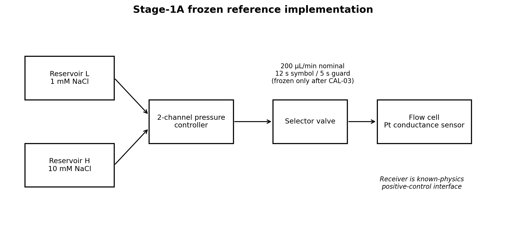
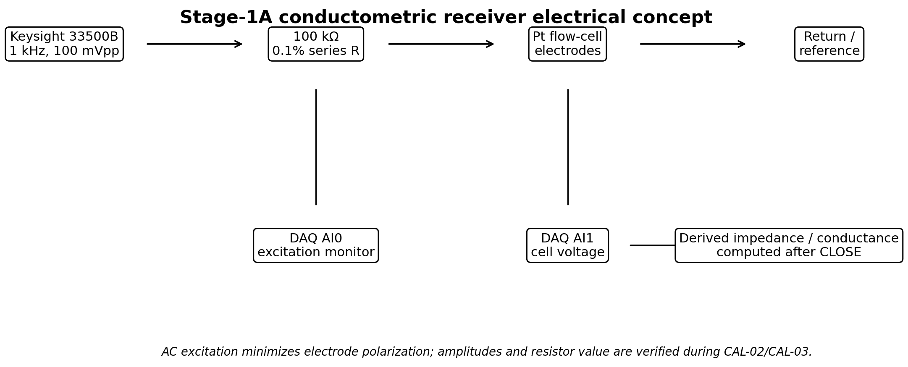
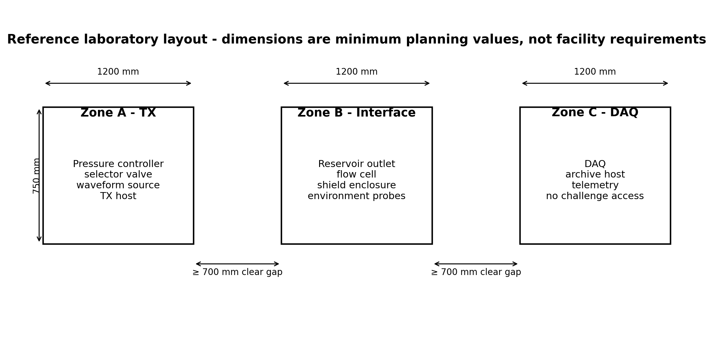
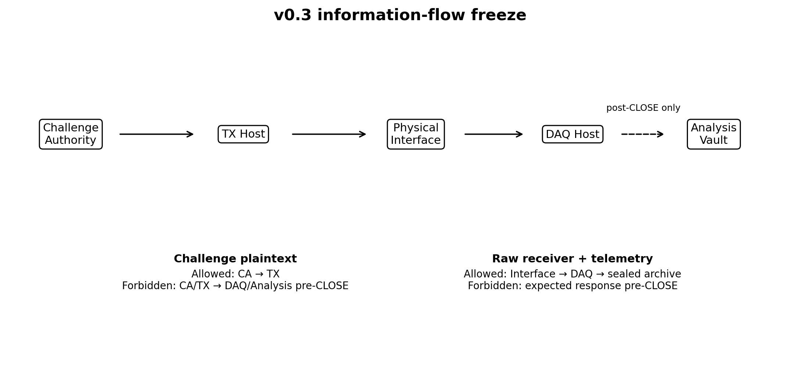

# Scale-SETI Phase-1 Design Package v0.3

**Companion to Formal Technical Review - Revision 5**  
Tim Boccaleri - September 2026

> Engineering development document. Phase 1 validates a conventional microscopic communication bench, leakage controls, blinding, data integrity, and reproducibility. It is not evidence of cross-scale communication.

## Document control

| Item | Value |
|---|---|
| Document | Scale-SETI Phase-1 Design Package |
| Version | v0.3 |
| Status | Engineering draft for technical review |
| Parent document | Scale-SETI Formal Technical Review - Revision 5 |
| Purpose | Convert the Phase-1 concept into a reproducible laboratory implementation package |
| Change from v0.2 | Freezes the Stage-1A reference implementation, adds component-level fluidic/electrical specifications, dimensioned bench layout, machine-readable JSON schemas, and a deterministic 100-trial synthetic dry-run package |

## 1. Scope and Phase-1 boundary

Phase 1 does **not** attempt to demonstrate cross-scale communication. It validates the experimental machinery required before such a search could be interpreted responsibly. The laboratory must first prove that it can generate unpredictable challenges, send them through a known microscopic communication path, capture receiver data without challenge leakage, quantify ordinary coupling paths, score trials only after the observation window closes, preserve immutable artifacts, and reproduce the procedure independently.

The Phase-1 reference implementation uses an ion or molecular communication path because that class of system is experimentally grounded and can be physically blocked, sham-driven, delayed, replayed, and instrumented. The same protocol can later be ported to more fundamental interfaces only after the reference bench satisfies all acceptance gates.

## 2. Requirements and traceability

| ID | Requirement | Verification | Gate |
|---|---|---|---|
| PH1-R01 | Generate a fresh challenge only after ARM | RNG audit, timestamp audit, challenge commitment | A4/A5 |
| PH1-R02 | Receiver analysis cannot access challenge plaintext before CLOSE | Access-control test, packet capture, code review | A4 |
| PH1-R03 | Known-link positive controls meet calibrated BER target | At least 1,000,000 transmitted bits or justified equivalent | A2 |
| PH1-R04 | Blocked-path and sham trials establish empirical false-positive floor | At least 1,000 blinded controls before escalation | A4 |
| PH1-R05 | Environmental channels are captured with receiver data | Telemetry completeness and synchronization audit | A3/A5 |
| PH1-R06 | Trial artifacts are immutable after capture close | SHA-256 manifest, append-only archive, audit log | A0/A5 |
| PH1-R07 | A second implementation can reproduce the written procedure | External dry-run / replication review | A6 |
| PH1-R08 | Intentional challenge paths are physically enumerable | Wiring, fluidic, software, and network path review | A3 |
| PH1-R09 | Every analog/digital I/O point is uniquely labeled and documented | I/O map and cable schedule inspection | A0 |
| PH1-R10 | Trial mode is blinded from the receiver/analysis path until CLOSE | Randomization audit and sealed condition record | A4 |

## 3. Reference architecture

The reference architecture separates challenge generation, transmission, microscopic interface, reception, telemetry, capture, and scoring. The physical implementation may vary, but the trust boundaries may not be collapsed during confirmatory trials.

**Figure 1.** Phase-1 reference architecture.

## 4. Physical zones and isolation boundaries

The bench is divided into three zones.

- **Zone A - Challenge / TX:** challenge authority, TX host, waveform source, source-measure unit, transmitter driver, and the intentional stimulus side of the microscopic interface.
- **Zone B - Interface / RX:** microfluidic channel, ion/molecular propagation path, receiver sensor, preamplifier, local shielding, and passive environmental probes placed near the interface.
- **Zone C - DAQ / Archive:** independent acquisition host, telemetry aggregator, raw storage, append-only archive, and post-close export path.

During blocked-path and confirmatory trials, Zone A must have no routable data path to Zone C. Where practical, the receiver/DAQ path should use galvanic isolation or optical conversion. Shared mains power should be treated as a potential coupling path and instrumented or separated.

**Figure 2.** Zone and trust-boundary model.

## 5. Cable and wiring schedule

| Cable ID | From | To | Signal | Medium | Isolation / note |
|---|---|---|---|---|---|
| CBL-001 | TX Host | Waveform Source | SCPI/control | USB or isolated Ethernet | Disabled or disconnected during blinded capture if not required |
| CBL-002 | Waveform Source CH1 | TX Driver / injection electrode | Analog modulation | Shielded coax | Intentional TX path |
| CBL-003 | SMU HI/LO | TX electrode / sensor bias fixture | DC bias / source-measure | Triax | Guarded; document shield termination |
| CBL-004 | Receiver Sensor | Low-noise preamp | Sensor output | Triax / shielded twisted pair | Zone B only |
| CBL-005 | Preamp OUT | DAQ AI0 | Receiver analog | Coax | Prefer isolated front end |
| CBL-006 | Temperature probe | DAQ AI1 | Temperature | Sensor lead | Telemetry |
| CBL-007 | Vibration sensor | DAQ AI2 | Accelerometer | Shielded pair | Telemetry |
| CBL-008 | EM probe | DAQ AI3 | RF/EM envelope | Coax | Telemetry |
| CBL-009 | Acoustic sensor | DAQ AI4 | Acoustic envelope | Shielded pair | Telemetry |
| CBL-010 | Optical sensor | DAQ AI5 | Light level | Shielded pair | Telemetry |
| CBL-011 | TX current monitor | DAQ AI6 | TX current proxy | Isolated analog | Must not expose challenge plaintext; use aggregate/physical telemetry only |
| CBL-012 | Mains/power monitor | DAQ AI7 | Power/ground telemetry | Isolated sensor | Coupling-path monitoring |
| CBL-013 | Flow/pressure sensor | DAQ AI8 | Fluidic telemetry | Shielded pair | Interface-state monitoring |
| CBL-014 | DAQ timing output | Local marker recorder | Trial timing marker | Digital | No challenge data content |
| CBL-015 | Pump controller | Pump | Flow command | Vendor cable | Zone A; schedule logged |
| CBL-016 | Valve controller | Selector valve | State command | Vendor cable | Zone A; state transitions logged |
| CBL-017 | DAQ Host | Immutable archive | Artifact transfer | Dedicated storage link | One-way/controlled where practical |
| CBL-018 | Challenge Authority | TX Host | Sealed challenge receipt | Removable signed media / controlled local link | Challenge plaintext unavailable to Zone C |
| CBL-019 | DAQ Host | Export station | Sealed trial bundle | Signed removable media / optical path | Transfer only after CLOSE |
| CBL-020 | Export station | Analysis Vault | Trial bundle + post-close unseal | Offline transfer | Scoring begins only after validation |

All cables receive durable labels at both ends. Unused network interfaces, radios, Bluetooth, Wi-Fi, and management channels are disabled for confirmatory operation unless explicitly listed in the frozen manifest.

## 6. Reference I/O map

The following map assumes a multi-channel 16-bit DAQ such as the NI USB-6363 or an equivalent platform. Channel assignments are illustrative but must be frozen before a campaign.

| I/O | Name | Source / destination | Nominal range | Minimum sample rate | Role |
|---|---|---|---|---|---|
| AI0 | RX_MAIN | Receiver preamp | ±1 V or sensor-specific | 10 kS/s initial | Primary receiver signal |
| AI1 | TEMP_IF | Interface temperature | Sensor-specific | 10 S/s | Thermal telemetry |
| AI2 | VIB_IF | Interface vibration | ±5 V | 5 kS/s | Mechanical leakage telemetry |
| AI3 | EM_IF | Local EM probe | ±5 V | 100 kS/s | EM leakage telemetry |
| AI4 | ACOUSTIC_IF | Acoustic monitor | ±5 V | 48 kS/s | Acoustic leakage telemetry |
| AI5 | OPTICAL_IF | Optical monitor | 0-5 V | 1 kS/s | Optical leakage telemetry |
| AI6 | TX_CURRENT_MON | Isolated TX current proxy | ±5 V | 10 kS/s | Physical TX telemetry |
| AI7 | POWER_MON | Isolated power monitor | ±5 V | 5 kS/s | Shared-power coupling telemetry |
| AI8 | FLOW_PRESS | Flow / pressure | 0-5 V | 1 kS/s | Fluidic-state telemetry |
| AI9 | REF_DUMMY | Dummy sensor channel | ±1 V | Match AI0 | Common-mode / pipeline control |
| DI0 | TRIAL_ARM | Local state marker | TTL | Event | Trial state |
| DI1 | TX_ACTIVE | TX active marker | TTL | Event | Physical timing only |
| DI2 | CLOSE_MARK | Capture close marker | TTL | Event | Scoring boundary |
| DO0 | LOCAL_TEST | DAQ loopback/calibration | TTL | Event | Calibration only; disabled in campaigns |

The primary receiver and dummy receiver should use comparable analog conditioning so that software or common-mode artifacts can be detected without assuming that only the primary sensor is affected.

## 7. Environmental telemetry channel list

| Channel | Measurement objective | Location | Required metadata |
|---|---|---|---|
| Temperature | Detect thermal coupling and drift | At interface and DAQ enclosure | Sensor serial, calibration date, units |
| Vibration | Detect pump/valve/mechanical timing leakage | Optical table / interface enclosure | Axis, bandwidth, mounting method |
| EM/RF | Detect radiated challenge-correlated emissions | Near interface and cable ingress | Probe type, bandwidth, gain |
| Acoustic | Detect audible/ultrasonic actuation patterns | Zone B enclosure | Microphone type, bandwidth |
| Optical | Detect LEDs/display/optical leakage | Inside dark enclosure where practical | Wavelength sensitivity |
| Power/current | Detect challenge-correlated power signatures | Zone A and shared supply points | Isolation method, CT/shunt spec |
| Flow/pressure | Confirm fluidic state and detect schedule fingerprints | Upstream and/or at cell | Range, units, calibration |
| Room state | Door/open/occupancy event logging | Lab boundary | Event-only; no video required by default |

Telemetry is not used to “explain away” anomalies after the fact. It is part of the preregistered model set and must be included in the raw trial bundle before scoring.

## 8. Stage-1 microfluidic component specification

The Stage-1 interface is a known communication path, not an unknown-scale detector. It must be simple enough to model, block, replay, and independently reconstruct.

**Figure 3.** Reference microfluidic signal path.

### 8.1 Functional requirements

| ID | Requirement |
|---|---|
| MF-R01 | Carrier fluid chemistry is fixed and documented before calibration |
| MF-R02 | TX symbol states create two measurably distinct receiver states under positive control |
| MF-R03 | A selector valve or equivalent supports carrier-only/sham operation without changing analysis code |
| MF-R04 | The path can be physically blocked or bypassed for isolation controls |
| MF-R05 | Flow, pressure, temperature, and timing are recorded for every trial |
| MF-R06 | Wetted materials and sensor compatibility are documented |
| MF-R07 | Dead volume, nominal transport delay, dispersion, and recovery time are measured before trial timing is frozen |

### 8.2 Initial component classes

- pressure-driven or syringe pump with stable low-flow control;
- two- or multi-position selector valve;
- carrier reservoir and separate blank/sham reservoir;
- injection electrode or ion/molecular dosing point;
- microfluidic channel/cell compatible with the selected receiver;
- graphene-FET, electrochemical, ion-selective, or equivalent receiver with documented transfer function;
- upstream/downstream pressure or flow sensing;
- temperature measurement at the cell;
- chemically compatible waste/return path.

Exact tubing diameter, channel geometry, concentration, flow rate, and sensor chemistry remain **TBD by the chosen lab implementation** and must be measured during CAL-03 rather than copied from the concept paper.

## 9. Host and network isolation plan

**Figure 4.** Host/network isolation model.

### 9.1 Host roles

| Host | Primary responsibility | Network posture during capture |
|---|---|---|
| HOST-CA | Challenge generation and commitment | Offline; no DAQ route |
| HOST-TX | TX state machine and hardware control | No route to DAQ/analysis subnet |
| HOST-DAQ | Receiver + telemetry capture | Acquisition-only; no challenge store access |
| HOST-ARCH | Immutable/raw archive | Receives sealed trial artifacts |
| HOST-AN | Analysis and scoring | Offline from capture until CLOSE/unseal |
| HOST-XFER | Controlled transfer / validation | Used only for signed post-close movement |

### 9.2 Confirmatory-trial hardening

- disable Wi-Fi, Bluetooth, cellular modems, and unused NICs;
- disable automatic cloud synchronization and remote-management agents unless specifically required and documented;
- use local accounts and frozen software images;
- hash OS image, acquisition software, analysis software, and configuration before campaign start;
- prohibit clipboard/file-share bridges between challenge/TX and DAQ/analysis paths;
- record firewall rules, route tables, connected USB devices, active processes, and listening ports before and after each campaign;
- use separate power or measured isolated power where practical;
- maintain an auditable removable-media transfer procedure if air-gapped transfer is used.

The phrase “air gap” must not substitute for evidence. The isolation package must enumerate the physical, electrical, optical, acoustic, RF, software, timing, and human pathways that could transfer challenge information.

## 10. Software architecture and service interfaces

The reference software is intentionally split into small services with narrow contracts. A laboratory may use Python, C#, LabVIEW, or another environment, but the information-flow constraints must remain equivalent.

| Service | Inputs | Outputs | Forbidden access |
|---|---|---|---|
| challenge-authority | ARM request, campaign configuration | challenge_id, commitment hash, sealed payload | Receiver data |
| trial-orchestrator | trial schedule, condition token | state transitions, hardware commands | Plaintext expected response in blinded trials |
| tx-driver | symbol stream, hardware profile | instrument commands, TX receipt | Receiver stream |
| daq-capture | analog/digital I/O | immutable raw files, timing log | Challenge plaintext |
| telemetry-capture | telemetry I/O | telemetry files + metadata | Challenge plaintext |
| artifact-sealer | raw files, manifests | hashes, signed bundle | Scoring logic |
| unseal-service | sealed challenge, CLOSE evidence | plaintext challenge + expected transform | Pre-close execution |
| scorer | sealed trial bundle after unseal | decoded response, metrics, p-values | Hardware-control functions |
| review-tool | campaign outputs | reviewer package | Ability to alter raw artifacts |

### 10.1 Minimal service API concepts

**challenge-authority /arm** returns a trial identifier and commitment record only after the trial is armed.  
**challenge-authority /release** is permitted only after CLOSE evidence is present.  
**daq-capture /start** accepts trial identifier and acquisition profile but no challenge payload.  
**daq-capture /close** finalizes files, computes hashes, and returns an immutable manifest.  
**scorer /score** accepts only closed/unsealed bundles.

Authentication can be implementation-specific in development, but confirmatory campaigns should use signed requests or equivalent tamper-evident control logs.

## 11. Trial state machine and timing

**Figure 5.** Trial state and trust sequence.

The canonical state sequence is ARM -> GENERATE -> COMMIT -> TRANSMIT -> LISTEN/CAPTURE -> CLOSE -> UNSEAL -> SCORE -> ARCHIVE/REVIEW.

No analysis process may observe the expected response before CLOSE. The observation window, transform rule, decoder, and scoring thresholds are fixed before challenge generation. Trial conditions are randomized in advance or by a blinded condition authority and remain hidden from the receiver-analysis path until the trial is closed.

## 12. Machine-readable trial schema

A minimum trial record should contain:

```json
{
  "trial_id": "uuid",
  "campaign_id": "string",
  "protocol_version": 1,
  "condition_code_sealed": "opaque-token",
  "hardware_config_hash": "sha256",
  "software_config_hash": "sha256",
  "challenge_commitment": "sha256",
  "challenge_bits": null,
  "transform_id": 1,
  "t_arm_utc": "timestamp",
  "t_tx_start_utc": "timestamp",
  "t_tx_end_utc": "timestamp",
  "t_close_utc": "timestamp",
  "raw_receiver_uri": "artifact-ref",
  "raw_receiver_sha256": "sha256",
  "telemetry_uri": "artifact-ref",
  "telemetry_sha256": "sha256",
  "decoded_response": null,
  "score_status": "SEALED"
}
```

After CLOSE and unseal, challenge_bits, expected response, decoded response, Hamming distance, empirical/null-model statistics, review status, and analysis-build hash are appended as a new signed record rather than rewriting the raw acquisition record.

## 13. Calibration worksheets

### CAL-01 - Inventory, identity, and configuration freeze

**Objective:** establish exactly what hardware/software instance produced the campaign.

**Record:** instrument manufacturer/model/serial; firmware; calibration status; host image hash; application build hash; cable IDs; sensor serials; fluidic component IDs; network interfaces; disabled radios; operator; date/time.

**Pass:** all listed items match the approved manifest and no unapproved interface is active.

**Worksheet fields:**
- Campaign ID: __________
- Apparatus ID: __________
- Manifest hash: __________
- Deviations found: __________
- Corrective action: __________
- Reviewer initials/date: __________

### CAL-02 - DAQ and analog chain calibration

**Objective:** characterize offset, gain, noise, bandwidth, clipping, timing, and channel crosstalk.

**Method:** precision source/load or loopback fixture; zero-input capture; known-amplitude sweeps; timing marker injection; adjacent-channel activity test.

**Pass:** results remain within manufacturer/lab tolerance and preregistered campaign limits; no unmodeled crosstalk large enough to create a valid challenge response.

### CAL-03 - Known microscopic channel transfer function

**Objective:** establish symbol-state separation, transport delay, dispersion, settling/recovery, and BER versus operating point.

**Method:** long known-pattern sequences over the complete fluidic path at candidate flow/concentration settings.

**Pass:** selected operating point meets BER <= 1e-3 over at least 1e6 bits or a technically justified equivalent dataset.

### CAL-04 - Blocked-path isolation survey

**Objective:** verify that removing the intended microscopic path removes challenge information from the receiver path.

**Method:** execute the identical TX schedule with the physical communication route blocked or diverted; record all receiver/telemetry channels.

**Pass:** no preregistered challenge-linked metric exceeds the corrected control threshold.

### CAL-05 - Telemetry completeness and alignment

**Objective:** prove that required environmental channels are captured and time-aligned.

**Method:** inject known events visible in selected telemetry channels and verify their timestamps relative to DAQ timing markers.

**Pass:** >=99% required telemetry completeness; timing uncertainty within the declared campaign tolerance.

### CAL-06 - Blinding and premature-access test

**Objective:** demonstrate that receiver acquisition and scoring cannot access the challenge or expected response before CLOSE.

**Method:** permissions audit, route/firewall review, packet/log inspection, file-system access test, and controlled attempt to access the challenge store from receiver/analysis identities.

**Pass:** all attempted pre-close access fails and is logged; no challenge material appears in receiver/analysis logs, memory dumps selected for review, or network captures.

### CAL-07 - Artifact integrity and recovery

**Objective:** verify that trial artifacts cannot be silently altered after closure and that the archive can be reconstructed.

**Method:** create a test trial, seal/hash it, copy through the normal archival path, attempt controlled modification, validate detection, then restore from the preserved source bundle.

**Pass:** all unauthorized modifications are detected; hashes reproduce; archived data can be independently re-read and scored.

## 14. Acceptance gates

| Gate | Requirement | Pass criterion | Failure action |
|---|---|---|---|
| A0 | Inventory/hash verification | 100% match to frozen manifest | Stop and reconcile configuration |
| A1 | DAQ/analog calibration | Within declared tolerance | Recalibrate/repair |
| A2 | Known-link BER | <=1e-3 over >=1e6 bits or justified equivalent | Tune interface; do not isolate yet |
| A3 | Leakage survey | No unmodeled path carries challenge information above preregistered threshold | Redesign boundary |
| A4 | Blinded controls | No challenge-linked excess beyond corrected alpha | Debug pipeline |
| A5 | 100-trial commissioning | >=99% artifact/telemetry completeness; positives decode as specified | Repeat commissioning |
| A6 | External review | Reviewer disposition permits confirmatory campaign | Hold and remediate |

## 15. 100-trial commissioning campaign

The initial commissioning campaign remains:

- 25 known-link positive controls;
- 25 blocked-path trials;
- 20 sham-transmitter trials;
- 10 dummy-receiver trials;
- 10 delayed-reveal trials;
- 10 replay-schedule/fresh-challenge trials.

Trial order is randomized and concealed from the receiver-analysis path. Campaign success is not based on one “interesting” event; it is based on positive-control performance, null-control behavior, artifact completeness, absence of unexplained leakage, and successful blind scoring.

## 16. Preregistration template

Before challenge generation begins for a campaign, freeze and sign the following fields.

### 16.1 Scientific question
- Primary hypothesis: ______________________________________
- Null hypothesis: _________________________________________
- Experimental interface: __________________________________
- Campaign population / number of trials: ___________________

### 16.2 Challenge and response definition
- Challenge length: __________ bits
- RNG source and health-test method: _________________________
- Transform ID(s): _________________________________________
- Response decoder version/hash: ____________________________
- Valid-response definition: ________________________________

### 16.3 Timing
- Symbol interval: __________________________________________
- Observation windows: _____________________________________
- Guard interval: ___________________________________________
- Maximum allowed clock uncertainty: ________________________

### 16.4 Primary metric
- Primary endpoint: _________________________________________
- Null distribution construction: ___________________________
- Alpha: _________________________________________________
- Multiple-testing correction: ______________________________
- Minimum effect / promotion threshold: _____________________

### 16.5 Controls
- Positive-control fraction: ________________________________
- Blocked-path fraction: ____________________________________
- Sham fraction: ____________________________________________
- Dummy-receiver fraction: _________________________________
- Delayed/permuted/replay controls: _________________________

### 16.6 Exclusions and failure rules
- Predefined hardware-failure exclusion: ____________________
- Missing-data rule: ________________________________________
- Trial-abort conditions: ___________________________________
- Campaign-abort conditions: ________________________________

### 16.7 Frozen artifacts
- Hardware manifest hash: ___________________________________
- Software manifest hash: ___________________________________
- Protocol document hash: ___________________________________
- Analysis plan hash: ________________________________________
- Preregistration signer/date: _______________________________

No primary endpoint, transform, timing window, decoder, or exclusion rule may be changed after unblinding without clearly labeling the resulting analysis as exploratory.

## 17. Lab build and handoff checklist

### Mechanical / fluidic
- [ ] Bench layout matches controlled drawing
- [ ] All wetted materials documented
- [ ] Valve states fail safe / known
- [ ] Flow and pressure limits documented
- [ ] Waste path secured
- [ ] Receiver mount and shielding reproducible

### Electrical / instrumentation
- [ ] All cable IDs installed at both ends
- [ ] I/O map verified channel-by-channel
- [ ] Ground/shield plan documented
- [ ] Unused interfaces disabled
- [ ] Analog ranges prevent clipping in normal operation
- [ ] Isolation devices verified where specified

### Computing / software
- [ ] Host roles separated
- [ ] OS/application hashes frozen
- [ ] Route/firewall table captured
- [ ] Cloud sync and unapproved remote agents disabled
- [ ] Capture service cannot access challenge plaintext
- [ ] Post-close unseal path tested

### Data integrity
- [ ] Raw receiver data immutable after CLOSE
- [ ] Telemetry stored with matching trial ID
- [ ] Hash manifest generated automatically
- [ ] Controlled transfer procedure tested
- [ ] Independent readback/scoring verified

### Review readiness
- [ ] CAL-01 through CAL-07 signed
- [ ] A0 through A5 passed
- [ ] Open deviations listed
- [ ] Synthetic example dataset included
- [ ] External reviewer package generated

## 18. Change control

Every change after A0 must receive a change identifier, rationale, affected requirement(s), risk classification, and disposition. Any change to the interface, acquisition chain, challenge path, blinding boundary, decoder, timing, or analysis plan invalidates the applicable prior calibration unless a reviewer explicitly documents why recalibration is unnecessary.

Suggested change record:

| Field | Value |
|---|---|
| Change ID | CHG-YYYY-NNN |
| Date | |
| Requestor | |
| Description | |
| Reason | |
| Requirements affected | |
| Calibration affected | |
| Risk | Low / Medium / High |
| Approval | |
| Effective build hash | |

## 19. Replication package

The v0.2 replication package should contain:

1. Formal Technical Review - Revision 5;
2. Phase-1 Design Package v0.2;
3. controlled figures/drawings;
4. BOM with functional requirements and allowable equivalents;
5. cable schedule and I/O map;
6. microfluidic component specification;
7. host/network isolation plan;
8. source repository with tagged release and hashes;
9. CAL-01 through CAL-07 completed examples and blank forms;
10. preregistration template;
11. commissioning dataset schema and synthetic example data;
12. issue/deviation log template;
13. limitations statement and prohibited interpretations.

## 20. v0.3 engineering freeze decisions

Revision v0.3 resolves the principal implementation decisions left open in v0.2. The choices below define the **reference Stage-1A commissioning apparatus**. Equivalent substitutions are allowed only through documented change control and must preserve the functional requirements and isolation boundaries.

| Decision | v0.3 freeze | Rationale |
|---|---|---|
| Symbol carrier | Sodium-chloride concentration keying in aqueous carrier | Safe, inexpensive, well understood, easily blocked/shammed, large measurable contrast |
| Low symbol | 1 mM NaCl nominal | Clear low-conductivity state while remaining well above ultrapure-water instability |
| High symbol | 10 mM NaCl nominal | Approximately one decade concentration contrast for robust commissioning |
| Flow control | Two-channel pressure-driven controller; Elveflow OB1 MK4 is the reference candidate | Closed-loop microfluidic control, TTL trigger capability, software SDK support |
| Fluid selection | Bidirectional selector valve; Elveflow MUX Distribution 12/1 is the reference candidate | Low internal volume and programmable reagent switching |
| Nominal flow | 200 µL/min | Keeps transport delay practical while avoiding unnecessarily high pressure |
| Receiver | AC conductometric flow cell using platinum electrodes | Fully conventional physics, analog output, easy to characterize independently |
| AC excitation | 1 kHz, 100 mVpp nominal through 100 kΩ precision series resistor | Limits polarization/current while providing measurable impedance contrast |
| Primary acquisition | NI USB-6363 or equivalent 16-bit multifunction DAQ | Sufficient channel count and 2 MS/s aggregate capability for receiver plus telemetry |
| Waveform source | Keysight 33500B family or equivalent | Stable low-distortion excitation and programmable stimulus |
| Stage 1B | Graphene-FET or other nanoscale receiver only after Stage-1A acceptance | Prevents novel sensor behavior from being confused with protocol/isolation defects |

The concentration values, flow rate, excitation amplitude, and timing are **commissioning targets**, not scientific constants. CAL-02 and CAL-03 may adjust them if required to achieve stable, non-saturating receiver separation. Any adjustment must be frozen before blinded campaigns begin.

## 21. Stage-1A fluidic implementation specification



**Figure 6.** Frozen Stage-1A reference implementation.

### 21.1 Fluid chemistry

Use deionized water from a single lot to prepare both states. The initial reference solutions are 1.00 mM NaCl (L) and 10.00 mM NaCl (H). Record reagent manufacturer/lot, balance ID, water source, preparation date, measured temperature, and independent conductivity verification. Prepare enough volume for the complete campaign plus calibration and waste.

A blank/sham solution uses the same composition as the low state. A passive trial leaves the receiver flowing at the low state without challenge-dependent valve motion. These distinctions are important: BLOCKED, SHAM, and PASSIVE controls test different leakage mechanisms.

### 21.2 Fluidic geometry freeze

The reference fluidic path after the selector valve shall use 1/16-inch OD chemically compatible tubing with an internal diameter near 0.5 mm. The valve-to-receiver length should be held to **100 mm or less** where the facility layout permits. All dimensions are recorded in the apparatus manifest.

The reference receiver cell is a straight-through PEEK or equivalent chemically inert body with:

- nominal 1.0 mm internal flow bore;
- two platinum sensing electrodes exposed to the flowing solution;
- nominal electrode separation of 1.0 mm across or immediately adjacent to the flow path;
- minimal trapped volume and no gas pocket above the sensing region;
- removable fittings so the cell can be replaced by a dummy load or bypass for controls.

Because the exact cell constant depends on fabricated geometry, the geometry is not treated as known from CAD alone. CAL-02 establishes the electrical transfer function and CAL-03 measures the end-to-end transport/settling response with the actual assembled cell.

### 21.3 Timing targets

The initial engineering target is 200 µL/min, a 12-second symbol interval, and a 5-second guard interval. CAL-03 measures 10-90% and 5-95% transition times for L→H and H→L. The final symbol duration must be at least 1.5 times the slower measured 95% settling time unless a pre-registered equalization/decoder demonstrates lower intersymbol interference.

## 22. Stage-1A electrical receiver specification



**Figure 7.** AC conductometric receiver concept.

The reference receiver uses low-amplitude AC excitation so that the commissioning channel is dominated by solution impedance rather than DC electrode polarization. The waveform source provides a 1 kHz, 100 mVpp sine wave through a 100 kΩ, 0.1% series resistor into the platinum flow cell. The DAQ records both the source-side excitation and the cell-side voltage. Derived impedance/conductance is calculated **after CLOSE** from the raw synchronized waveforms.

The final resistor value and excitation amplitude may be changed during CAL-02 to place both L and H states comfortably within the DAQ input range without clipping and while keeping electrode current low. The chosen values are then frozen in the hardware manifest.

### 22.1 DAQ channel freeze

For v0.3, the primary analog map is amended as follows:

| Channel | v0.3 assignment | Minimum rate | Note |
|---|---|---:|---|
| AI0 | RX_EXCITATION | 20 kS/s | Measures actual 1 kHz excitation |
| AI1 | RX_CELL | 20 kS/s | Primary receiver waveform |
| AI2 | TEMP_IF | 10 S/s | Interface temperature |
| AI3 | VIB_IF | 5 kS/s | Vibration leakage monitor |
| AI4 | EM_IF | 100 kS/s | EM leakage monitor |
| AI5 | ACOUSTIC_IF | 48 kS/s | Acoustic leakage monitor |
| AI6 | OPTICAL_IF | 1 kS/s | Optical leakage monitor |
| AI7 | POWER_MON | 5 kS/s | Shared-power leakage monitor |
| AI8 | FLOW_PRESS | 1 kS/s | Flow/pressure state |
| AI9 | REF_DUMMY | 20 kS/s | Electrically similar dummy receiver |

The earlier v0.2 TX current-proxy channel becomes optional during Stage-1A if it would create an unnecessary information bridge. If used, it must be independently isolated and explicitly included in the leakage model.

## 23. Connector and wiring freeze

The reference NI USB-6363 BNC configuration uses BNC analog inputs. For the conductometric receiver, BNC center conductors carry the measured signal and shields are bonded according to the finalized grounding plan. Shields must not be connected at multiple points if doing so creates a measurable ground loop.

| Connection | Source | Destination | Reference implementation |
|---|---|---|---|
| E-001 | AWG CH1 | 100 kΩ series resistor | 50 Ω BNC coax, source set high-Z load unless verified otherwise |
| E-002 | Series resistor output | Pt electrode 1 | Shielded lead, shortest practical run |
| E-003 | Pt electrode 2 | AWG return/reference | Shielded return |
| E-004 | Excitation monitor | DAQ AI0 | BNC T/isolated monitor point |
| E-005 | Cell monitor | DAQ AI1 | High-impedance buffered monitor |
| E-006 | Dummy network | DAQ AI9 | Fixed RC network selected to approximate receiver impedance |
| E-007 | ARM marker | DAQ digital input | TTL only, no challenge content |
| E-008 | TX ACTIVE marker | DAQ digital input | TTL envelope only, no symbol content |
| E-009 | CLOSE marker | DAQ digital input | TTL event |

A pre-campaign continuity/insulation test records DC resistance between every Zone-A signal conductor and every Zone-C signal conductor with the intentional physical interface disconnected. Unexpected conductive paths are a hard failure of A3.

## 24. Dimensioned laboratory reference layout



**Figure 8.** Reference three-zone bench arrangement.

The reference planning layout uses three 1200 mm × 750 mm work surfaces with at least 700 mm clear separation between adjacent zones. This is not a universal facility requirement; the requirement is measurable separation of functions and enumerated coupling paths. Where available, Zone A and Zone C should use separate mains circuits or separately instrumented isolation supplies.

Zone B should contain the minimum active electronics necessary for sensing. Displays, networked computers, status LEDs, and unnecessary switching supplies are excluded from the immediate receiver enclosure during blinded trials.

## 25. Information-flow and software freeze



**Figure 9.** Information-flow freeze for confirmatory operation.

The Challenge Authority may provide plaintext challenge information only to the TX path. The DAQ receives trial identifiers, acquisition settings, and state markers, but never challenge plaintext or expected response before CLOSE. The Analysis Vault receives receiver and telemetry artifacts only after they are sealed, and receives challenge plaintext only after CLOSE evidence has been validated.

### 25.1 Repository freeze

The software repository is divided into:

```text
/scale-seti-phase1
  /challenge-authority
  /tx-driver
  /daq-capture
  /telemetry-capture
  /artifact-sealer
  /unseal-service
  /scorer
  /schemas
  /tests
  /campaigns
```

No shared application library may contain both challenge-plaintext handling and receiver-decoding functions unless the confirmatory deployment compiles/deploys them into separate trust domains and a code review demonstrates that no pre-CLOSE path exists.

## 26. Machine-readable schemas

v0.3 creates four normative JSON Schema files distributed with the design package:

1. `trial_record.schema.json` - per-trial lifecycle and artifact references;
2. `campaign_manifest.schema.json` - frozen campaign configuration;
3. `calibration_record.schema.json` - CAL-01 through CAL-07 results;
4. `scoring_output.schema.json` - post-CLOSE scoring output.

The schemas use JSON Schema Draft 2020-12. Implementations may store equivalent records in a database, but exported replication bundles must validate against the published schemas or a versioned successor.

## 27. Synthetic 100-trial dry-run campaign

Before hardware exists, the software pipeline should be exercised against deterministic synthetic data. v0.3 includes a 100-trial commissioning set with 25 trials in each condition: POSITIVE, BLOCKED, SHAM, and PASSIVE.

The synthetic POSITIVE trials intentionally produce near-perfect challenge recovery. Control trials intentionally produce random 128-bit outputs around the 50% bit-accuracy null expectation. A second file contains normalized receiver and telemetry time series. These files exist **only to validate software plumbing** and must never be represented as experimental observations.

The included `score_campaign.py` recomputes Hamming distances, produces condition-level summaries, and applies a deliberately simple sanity gate: high positive-control accuracy and approximately chance-level control accuracy. This script is a reference dry-run utility, not the final statistical analysis plan.

### 27.1 v0.3 synthetic expected behavior

| Condition | Trials | Expected bit accuracy | Expected exact matches |
|---|---:|---:|---:|
| POSITIVE | 25 | > 0.98 | Many |
| BLOCKED | 25 | ~0.50 | 0 expected |
| SHAM | 25 | ~0.50 | 0 expected |
| PASSIVE | 25 | ~0.50 | 0 expected |

The dry-run package also includes a synthetic campaign manifest and generated scoring output so independent teams can test import, schema validation, hashing, and analysis without the physical apparatus.

## 28. Stage-1A acceptance additions

The existing A0-A6 gates remain in force. v0.3 adds the following Stage-1A commissioning criteria before the apparatus may enter the 100-trial blinded campaign:

| ID | Criterion | Pass condition |
|---|---|---|
| A2.1 | L/H electrical separation | Receiver distributions separated with no clipping; target Cohen's d ≥ 5 during calibration |
| A2.2 | Transition repeatability | 95% settling time CV ≤ 15% across 20 L↔H transitions |
| A2.3 | Residual memory | After configured guard interval, prior symbol improves next-symbol prediction by < 1% absolute |
| A3.1 | Zone isolation | No undocumented conductive/network path between Challenge/TX and DAQ/Analysis |
| A3.2 | Dummy receiver | Challenge correlation indistinguishable from preregistered null |
| A4.1 | Blinding dry run | Analysis operator cannot identify condition above chance from metadata before unseal |
| A5.1 | Schema validation | 100% of campaign records validate against v0.3 schemas |

These thresholds are engineering starting points and must receive statistical review before a confirmatory study.

## 29. Stage 1B transition rule

Stage 1B replaces only the **receiver interface** after Stage-1A completes A0-A6. The challenge authority, blinding, capture, telemetry, archive, and scoring boundaries remain unchanged. The preferred first Stage-1B candidate is a graphene-FET or equivalent nanoscale ion-sensitive receiver with a documented transfer function.

The reason for this sequence is methodological: if a custom nanoscale sensor produces an anomaly before the protocol stack is validated, the experiment cannot distinguish sensor novelty from information-channel novelty. Stage-1A removes that ambiguity.

## 30. v0.3 release artifacts

The v0.3 engineering release contains:

- the DOCX/PDF/Markdown design package;
- four engineering figures;
- four JSON Schema files;
- a deterministic 100-trial synthetic campaign;
- synthetic receiver/telemetry traces;
- a reference scoring script;
- generated scoring outputs and campaign summary;
- README instructions for the dry run.

This is the first release intended to be sufficiently concrete that a second team can critique the selected Stage-1A implementation rather than only the concept.

## References

1. Zhang, S.; Akan, O. B. “Ion Transmitter for Molecular Communication.” *IEEE Transactions on Nanobioscience* 25(3), 361-370 (2026). DOI: 10.1109/TNB.2026.3676352.
2. Kuscu, M. et al. “Fabrication and microfluidic analysis of graphene-based molecular communication receiver for Internet of Nano Things (IoNT).” *Scientific Reports* 11, 19600 (2021). DOI: 10.1038/s41598-021-98609-1.
3. National Instruments. USB-6363 product specifications: 32 AI, 16-bit, 2 MS/s; 4 AO; 48 DIO. Accessed September 2026.
4. Keysight Technologies. 33500B Series Waveform Generators product documentation: up to 250 MSa/s, 16-bit amplitude resolution. Accessed September 2026.
5. Tektronix/Keithley. Model 2450 Source Measure Unit documentation and specifications. Accessed September 2026.
6. ID Quantique. Quantis QRNG PCIe product documentation. Accessed September 2026.
7. *Scale-SETI: A Search for Technological Intelligence Across Physical Scale.* Formal Technical Review Draft - Revision 5 (2026).

8. NI. “USB-6363 Multifunction I/O Device.” Product specifications, accessed September 2026. https://www.ni.com/en/shop/hardware/voltage/model-usb-6363

9. Keysight Technologies. “33500B Series Trueform Waveform Generators.” Data sheet, accessed September 2026. https://www.keysight.com/

10. Elveflow. “OB1 MK4 Microfluidic Flow Controller.” Product specifications, accessed September 2026. https://elveflow.com/microfluidic-products/microfluidics-flow-control-systems/ob1-pressure-controller/

11. Elveflow. “MUX Distribution 12/1 Bidirectional Microfluidic Valve.” Product specifications, accessed September 2026. https://www.elveflow.com/microfluidic-products/microfluidics-flow-control-systems/mux-distrib/

